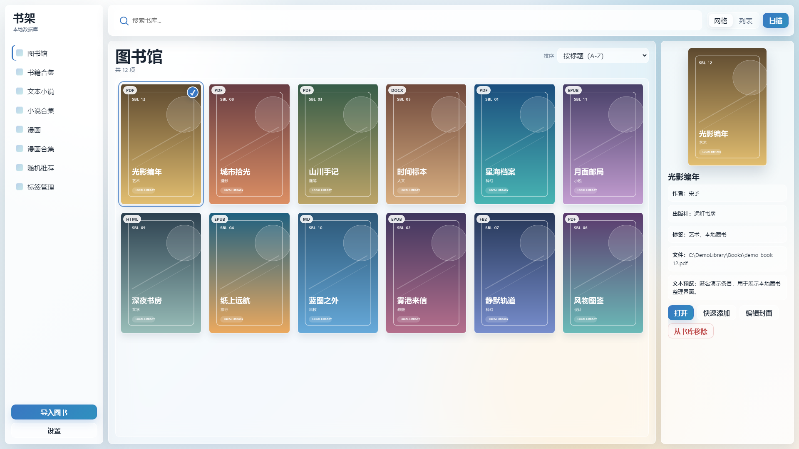

# Simple Book Library — Local Ebook & Comic Manager for Windows

**v2.5.0** · **Windows 10 / 11** · **MIT License** · [中文](README.md)

Simple Book Library is an offline personal library organizer for PDFs, EPUBs, documents, CBZ comics, comic image folders, and TXT novels.

It catalogs local files in one desktop library while letting you keep the reading apps you already use.

**[Download the latest stable Windows package](https://github.com/Larliers/Simple-Book-library/releases/latest)**



_Captured from the real Qt WebEngine interface with anonymous demo records and programmatically generated covers._

## Who is it for?

- Readers with local PDFs, EPUBs, DOCX files, or Markdown books spread across multiple folders.
- Comic collectors who want a local CBZ comic library or an index of image-based comic folders.
- TXT novel readers who need encoding detection, covers, previews, and configurable import rules.
- Anyone who wants an offline ebook manager without cloud uploads, accounts, or a built-in reader.

## Core features

### One library for three local collections

- **Library**: PDF, EPUB, HTML, Markdown, FB2, and DOCX with grid/list views, details, search, tags, and covers.
- **Text Novel**: TXT with UTF-8, GBK, and other encoding detection, plus metadata rules for filenames and body text.
- **Comic**: leaf image folders and CBZ archives, with waterfall or paginated browsing and external viewer support.

### Built for personal libraries that keep growing

- Scan one or more root folders instead of entering files individually.
- Skip unchanged content with incremental scanning and Fast, Quick, or Strict fingerprint strategies.
- Keep large cover grids and lists responsive with viewport virtualization.
- Organize books, novels, and comics in separate typed collections.

### Local-first by design

- The database, cover cache, and scan logs stay on your computer.
- Double-click an item to open it with the Windows default app you already trust.
- Switch between offline Glass and Vaporwave skins, each with day, night, and automatic themes.

## Stable release vs. main

| Status | Included capabilities |
|--------|-----------------------|
| **Stable v2.4.0** | Three resource scanners and collection types, covers and thumbnails, search, TXT import rules, random recommendations, configurable shortcuts, Text Novel grid/list sorting, and Glass/Vaporwave skins |
| **Current main** | Adds a standalone tag manager, in-place Quick Add for all three resource types, persistent Library/book-collection sorting, multi-selection and batch collection actions, Library image-folder books, automatic collection rules, plus later fixes |

The Releases page contains the stable build. Features listed under main remain source-only until a later Release completes validation; choose the stable package if you simply want to use the app.

## Get started in three steps

1. Download the `win64.zip` from [GitHub Releases](https://github.com/Larliers/Simple-Book-library/releases/latest), extract it, and double-click `main.exe`.
2. Open **Settings → Paths & Scan** and add roots for books, comics, or TXT novels.
3. Select **Scan** to build the library. Click for details or double-click to open a resource in its default app.

> Imports are folder-based; individual files cannot be dragged into the window. The first scan of a large collection may take time while metadata and covers are generated.

## Supported formats

| Resource | Supported content | Browse and organize |
|----------|-------------------|---------------------|
| **Ebooks and documents** | PDF, EPUB, HTML/HTM, Markdown, FB2/FB2.ZIP, DOCX | Grid/list views, details, tags, search, book collections |
| **Text novels** | TXT | Encoding detection, text preview, same-stem sidecar covers, import rules, novel collections |
| **Comics** | Leaf folders containing JPG/JPEG/PNG/WebP/GIF/BMP/TIFF images, plus CBZ | Waterfall/pagination, covers, comic collections, external opening |

> **Current main only:** Library can also import a folder as one regular book when it is within levels 1 through the configured scan depth, has no subfolders, contains at least three supported images, and has more images than other files. The card shows an `IMG` badge, and the first naturally sorted image supplies both the automatic cover and double-click target. This is not part of stable v2.4.0.

### Search, covers, and TXT rules

- Library search understands `title:`, `author:`, and `tag:` prefixes.
- PDFs prefer an embedded cover and fall back to a title placeholder when no usable image exists.
- TXT files can use a same-stem WebP, PNG, JPG, or JPEG cover; manually selected covers remain authoritative.
- Edit TXT rule chains and preview extracted metadata under **Settings → Paths & Scan → Rules**.
- If you use download automation, browser extensions, or Tampermonkey/Greasemonkey userscripts to collect TXT books from websites, Rules can turn filename or body text into titles, authors, and tags after import.
- That saves you from tagging every file by hand. Rules classify local files; they do not download content.

### Automatic collection rules (current main only)

- Each Book, Text Novel, or Comic collection can independently match source filenames or folder names with contains, excludes, starts-with, ends-with, and exact conditions. One resource may enter every matching collection.
- Open **Edit collection rule…** from a collection card's context menu, or manage all rules under **Settings → Collection Rules**. A required preview shows additions, removals, manual keeps, and exclusions before saving.
- These rules organize resources already imported into the local library. They neither browse nor download content, and are not included in stable v2.4.0 yet.

## Local data and privacy

The core workflow does not require an online service. Simple Book Library does not upload book content or fetch online catalogs. The update checker contacts GitHub Release information only when you invoke it.

| Run mode | Data location |
|----------|---------------|
| **Packaged app** | `sql/library.db`, `img_preview/`, and `Scan_error_logs/` beside `main.exe` |
| **From source** | `src/sql/library.db`, root-level `img_preview/`, and `src/Scan_error_logs/` |

When upgrading a packaged copy, keep those three user-data directories and replace only `main.exe` and the bundled program files.

## Limitations

- This project is a local resource manager, not a built-in PDF, EPUB, TXT, or comic reader.
- It does not provide cloud sync, online content scraping, user accounts, or cross-device libraries.
- Comics support image folders and CBZ, but not CBR or other archive formats.
- Opening resources depends on Windows file associations and your installed reader or image viewer.
- Scan and thumbnail jobs are mutually exclusive. Without PyMuPDF, PDFs remain indexable but metadata and covers may be incomplete.

## Run from source

Source development requires Windows 10/11 and Python 3.10+. Python 3.10.6 is recommended to match the locked environment.

```powershell
python -m venv .venv
.\.venv\Scripts\Activate.ps1
pip install -r requirements.txt
.\.venv\Scripts\pythonw.exe src\main.py
```

### Developer checks and packaging

```powershell
pip install -r requirements-dev.txt
$env:PYTHONPATH="src"
.\.venv\Scripts\python.exe -m pytest src/tests -q
.\.venv\Scripts\python.exe src\main.py --check-pymupdf

.\scripts\build_nuitka.ps1
.\scripts\pack_release.ps1
```

See [`src_construction.md`](src_construction.md) for the source map. Historical UI references live under `Simple-Book-library-Dev_Document/UI/`.

## Get help

For scan, cover, encoding, or interface problems, open a [GitHub Issue](https://github.com/Larliers/Simple-Book-library/issues) with reproduction steps, your Windows version, and relevant errors.

Do not upload private books, databases, or complete logs containing personal paths.

## License

Simple Book Library is available under the [MIT License](LICENSE). Third-party dependencies and fonts retain their respective licenses.
