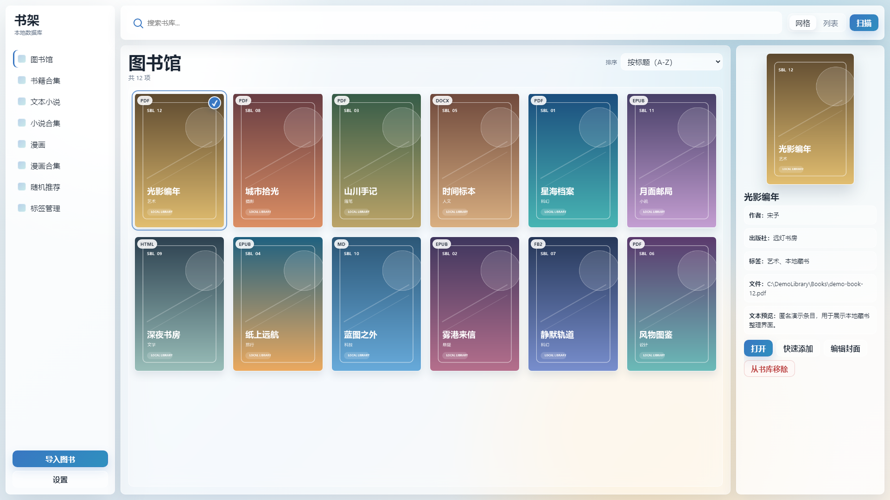

# Simple Book Library：Windows 本地电子书与漫画管理器

**v2.6.0** · **Windows 10 / 11** · **MIT License** · [English](README.en.md)

Simple Book Library（简易图书馆）是一款离线运行的个人藏书管理软件。它把本机的 PDF、EPUB、文档、CBZ 漫画、漫画图片文件夹和 TXT 小说整理进同一个本地图书馆，并保留你习惯的系统阅读器。

**[下载最新稳定版 Windows 压缩包](https://github.com/Larliers/Simple-Book-library/releases/latest)**



_截图来自真实 Qt WebEngine 运行界面，内容均为匿名演示数据和程序生成封面。_

## 适合谁用

- 本机散落着 PDF、EPUB、DOCX、Markdown 等电子书，希望按封面统一浏览。
- 收藏 CBZ 漫画或漫画图片文件夹，需要一个本地漫画书库。
- 保存大量 TXT 小说，需要编码识别、封面、预览和自定义导入规则。
- 不想上传私人藏书，也不需要云账号、在线书源或内置阅读器。

## 核心能力

### 一个入口管理三类本地资源

- **图书馆**：管理 PDF、EPUB、HTML、Markdown、FB2、DOCX，支持网格/列表、详情、搜索、标签和封面。
- **文本小说**：管理 TXT，自动探测 UTF-8、GBK 等编码，并可用规则从文件名或正文提取标题、作者和标签。
- **漫画**：把含图片的叶子文件夹或 CBZ 视为一本漫画，支持瀑布流、分页和外部看图软件打开。

### 为个人大书库设计

- 配置一个或多个根目录后递归扫描，不必逐个录入文件。
- 增量扫描可跳过未变化内容，并提供 Fast、Quick、Strict 三种指纹策略。
- 封面网格和列表采用视口虚拟化，减少大书库首屏压力。
- 书籍、小说和漫画拥有彼此独立的合集，避免不同资源类型混在一起。

### 保持本地优先

- 数据库、封面缓存和扫描日志都保存在本机。
- 双击资源后交给 Windows 默认程序打开，不强迫你更换阅读器。
- Glass 与 Vaporwave 两套界面皮肤均可离线使用，并支持日间、夜间和自动主题。

## 稳定版与 main 分支

| 状态 | 包含内容 |
|------|----------|
| **稳定版 v2.6.0** | v2.5.0 全部能力，以及按已保存元数据字段归档、文本小说系列与手动标签管理、按作者自动归档、标签目录滚动位置恢复 |
| **当前 main** | v2.6.0 后续开发；未发布能力会与稳定版分开说明 |

Release 下载页提供经过远程 Windows 打包的稳定版；如果你只想直接使用软件，请优先下载稳定版。

## 三步开始使用

1. 从 [GitHub Releases](https://github.com/Larliers/Simple-Book-library/releases/latest) 下载 `win64.zip`，解压后双击 `main.exe`。
2. 打开 **设置 → 路径与扫描**，分别配置图书、漫画或文本小说的根目录。
3. 点击 **扫描** 建立书库；单击查看详情，双击用系统默认程序打开资源。

> 软件采用目录级扫描，不支持把单个文件拖入窗口。第一次扫描大型书库时，元数据和封面生成可能需要一些时间。

## 支持格式

| 资源 | 支持内容 | 浏览与整理 |
|------|----------|------------|
| **电子书与文档** | PDF、EPUB、HTML/HTM、Markdown、FB2/FB2.ZIP、DOCX | 网格/列表、详情、标签、搜索、书籍合集 |
| **文本小说** | TXT | 编码识别、正文预览、同名旁置封面、导入规则、小说合集 |
| **漫画** | JPG/JPEG/PNG/WebP/GIF/BMP/TIFF 图片叶子文件夹、CBZ | 瀑布流/分页、封面、漫画合集、外部打开 |

总书库还能把根目录第 1～扫描深度层内、无子目录、至少含 3 张图片且图片多于其他文件的目录作为一本普通书籍导入。卡片显示 `IMG` 角标，首张自然序图片用于自动封面和双击打开。

### 搜索、封面与 TXT 规则

- 图书馆搜索支持 `title:`、`author:`、`tag:` 前缀。
- PDF 优先使用内嵌封面；没有可用图片时显示标题占位卡。
- TXT 可读取同目录同名的 WebP、PNG、JPG 或 JPEG 封面，手动设置的封面优先保留。
- **设置 → 路径与扫描 → Rules** 可编辑 TXT 规则链，并实时预览提取结果。
- 如果你用自动化程序、浏览器插件或油猴脚本从网站下载 TXT 图书，Rules 可以把导入后的文件名或正文信息提取为标题、作者和标签，再按规则分类；不用逐本手动打 Tag。Rules 只负责识别与分类，不负责下载内容。

### 集合规则自动归档

- 每个书籍、Text Novel 或 Comic 合集都能单独启用规则，按来源文件名或目录名的包含、排除、开头、结尾和完全相等条件自动归档；同一资源可进入多个命中合集。
- 从合集卡片右键选择“编辑集合规则…”，或前往 **设置 → 集合规则** 统一管理。保存前会先预览新增、移除、手动保留和排除项；手动移除的命中资源不会被下次扫描立即加回。
- 该能力只整理已经导入的本地资源，不扫描网络或下载内容。
- 每条集合规则可选择来源原名或资源已保存的元数据字段；字段按资源类型提供标题、作者、出版社、语言、标签和系列。手动修改标签后会立即更新命中合集，扫描会保留文本小说的手动标签。
- Text Novel 主列表提供可排序的系列列，小说合集仍在详情中显示路径；旧小说的系列会在下次文本扫描后补齐。
- **根据作者归档**可跨路径为每个非空作者建立或复用小说合集，并随文本扫描更新。保存前预览新建、复用和冲突；关闭时可撤销自动成员或转为手动，集合与排除记录保留。
- 从标签详情返回目录时会恢复原滚动位置；本次启动内切换到其他页面再回来也会恢复。

## 本地数据与隐私

Simple Book Library 的核心流程不依赖在线服务。它不会上传书籍内容，也不会抓取在线书源；仅“检查更新”功能会在你主动触发时访问 GitHub Release 信息。

| 使用方式 | 数据位置 |
|----------|----------|
| **发行包** | `sql/library.db`、`img_preview/`、`Scan_error_logs/`，均位于 `main.exe` 同级目录 |
| **源码运行** | `src/sql/library.db`、项目根目录 `img_preview/`、`src/Scan_error_logs/` |

升级发行包时，请保留上述三个用户数据目录，只替换 `main.exe` 和同目录程序文件。
运行含作者归档预设的新版本前，请先备份 `sql/library.db`；若回退旧版程序，请同时恢复对应的升级前数据库备份。

## 使用前请知晓

- 本项目是本地资源管理器，不是 PDF、EPUB、TXT 或漫画的内置阅读器。
- 不提供云同步、在线内容抓取、账号系统或跨设备书库。
- 漫画支持图片文件夹和 CBZ，不支持 CBR 等其他压缩格式。
- 打开资源依赖 Windows 文件关联；请先安装并配置你常用的阅读器或看图软件。
- 扫描与缩略图任务互斥。PyMuPDF 不可用时 PDF 仍可入库，但元数据和封面可能不完整。

## 从源码运行

源码环境需要 Windows 10/11 和 Python 3.10+，推荐使用与依赖锁定一致的 Python 3.10.6。

```powershell
python -m venv .venv
.\.venv\Scripts\Activate.ps1
pip install -r requirements.txt
.\.venv\Scripts\pythonw.exe src\main.py
```

环境安装完成后，也可双击根目录的 `启动书库.cmd` 打开软件。

### 开发自检与打包

```powershell
pip install -r requirements-dev.txt
$env:PYTHONPATH="src"
.\.venv\Scripts\python.exe -m pytest src/tests -q
.\.venv\Scripts\python.exe src\main.py --check-pymupdf

.\scripts\build_nuitka.ps1
.\scripts\pack_release.ps1
```

源码结构见 [`src_construction.md`](src_construction.md)。UI 设计史料位于 `Simple-Book-library-Dev_Document/UI/`。

## 获取帮助

遇到扫描、封面、编码或界面问题时，请在 [GitHub Issues](https://github.com/Larliers/Simple-Book-library/issues) 提交复现步骤、系统版本和相关错误信息。请勿上传私人书籍、数据库或包含个人路径的完整日志。

## 许可证

本项目采用 [MIT License](LICENSE)。第三方依赖与字体遵循各自许可证。
